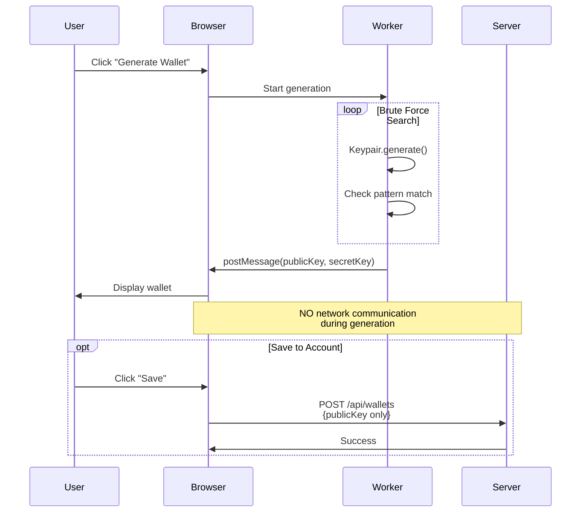

# Architecture Diagrams

This folder will contain visual diagrams to help understand the security architecture.

---

## Planned Diagrams

### 1. Wallet Generation Flow
- Show Web Worker isolation
- Illustrate that private keys never leave browser
- Highlight the `Keypair.generate()` step

### 2. Telegram Authentication Flow
- OAuth flow diagram
- Show what data is sent to server (only Telegram ID)
- Prove separation from wallet generation

### 3. Data Storage Model
- Database schema showing what IS stored
- Highlight absence of private key fields

---

## How to Create These

You can use tools like:
- **Mermaid** (text-based diagrams, renders in GitHub)
- **draw.io** / **Excalidraw** (visual editors)
- **ASCII diagrams** (simple text art)

---

## Example: Mermaid Diagram

---

## Contributing

If you're a security researcher and want to contribute diagrams:
1. Create visual representations using the tools above
2. Save as PNG/SVG in this folder
3. Reference them in the main README

**Note**: This is a transparency repo, not accepting code contributions. Only visual aids for security verification.
